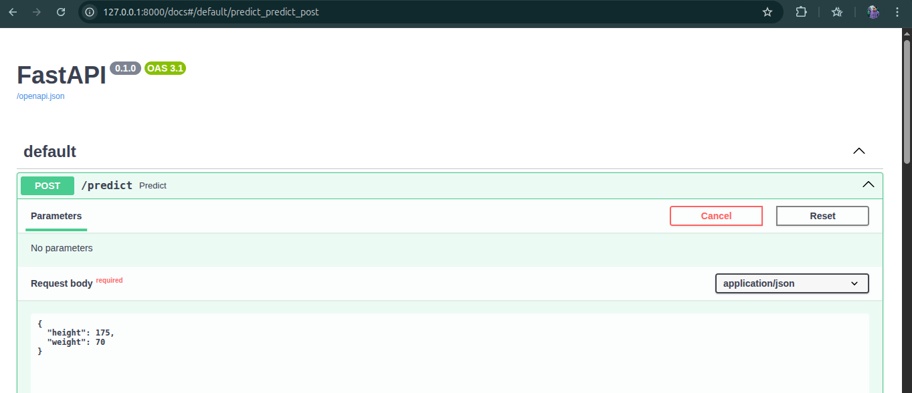
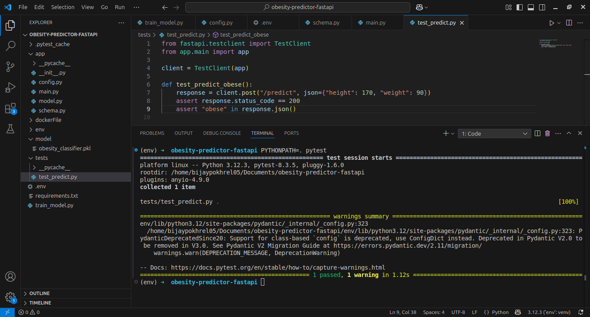

# Obesity Prediction API

A FastAPI-based microservice that predicts whether a person is obese based on height and weight using a classification machine learning model.

---

## Features

- Predict obesity status from height and weight inputs
- Clean, modular FastAPI app applying 12-Factor principles:
  - Configurations via environment variables
  - Clear project structure
  - Automated testing with pytest
- Interactive API docs available at `/docs`
- Easily runnable locally with minimal setup

---

## Getting Started

### Prerequisites

- Python 3.8+
- [pip](https://pip.pypa.io/en/stable/installation/)

### Installation

1. Clone the repo:

   ```bash
   git clone https://github.com/yourusername/obesity-predictor-fastapi.git
   cd obesity-predictor-fastapi

2. Create and activate a virtual environment:
    ```bash
    python3 -m venv venv
    source venv/bin/activate
    ```
3. Install dependencies:
    ```bash
   pip install -r requirements.txt
    ```
___
### Running Application
Start the FastAPI server:

    ```
    uvicorn app.main:app --reload --host 0.0.0.0 --port ${PORT:-8000}
    ```
### API Usage
Open your browser and navigate to:

    ```
    https://localhost:8000/docs
    ```
Use the interactive Swagger UI to test the /predict POST endpoint by submitting JSON like:



The response will indicate the person is not obese for above features.


### Testing


Run tests with:

    ```
    PYTHONPATH=. pytest
    ```
___
### Additional Notes
- No Docker included (can be added later)
- Followed best practices with environment variables and modular code
- For any questions or suggestions, please open an issue
